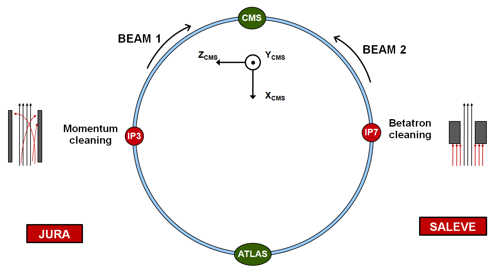
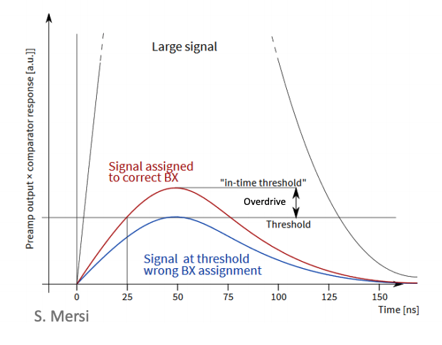

## Data source

The workflow uses data simulated with CMSSW version 11.2.0.pre6.  
Simulation outputs are saved in hdf5 files and no ROOT files are involved in the process.  
The hdf5 files have the following data structure:  

- group: Tof_q  
- datasets: dXrY, where X is the TEPX disc ID ((-4)-4) and Y is the TEPX ring ID (1-5)  

Each dataset consists of rows of size 2, containing time of flight [ns] - charge [GeV or e-] pairs.  
The hdf5 files together with the standard ROOT simulation outputs are located on lxplus EOS at:  
`/eos/cms/store/group/dpg_bril/comm_bril/phase2-sim`

BIB simulation outputs are located at:  
`/eos/cms/store/group/dpg_bril/comm_bril/phase2-sim/bib_simulations_fullgeo/hdf5`

The directory `full_stat_simhit` contains the main simulation results with the following number of events:  

- beam halo: 500.000 (500.000)
- beam gas carbon: 165.000 (200.000)
- beam gas oxygen: 190.000 (200.000)
- beam gas hydrogen: 185.000 (195.000)

Pileup events are simulated in a similar way and the corresponding hdf5 outputs are located at:
`/eos/cms/store/group/dpg_bril/comm_bril/phase2-sim/pu_simulations_fullgeo/hdf5`

The directory `full_stat_simhit` contains the main simulation results with the following number of events:  

- PU 200: 930 (1000)

The number of events launched are indicated in brackets. Simulations are always split into multiple jobs (10 events/job for PU and 5000 events for BIB) and submitted to lxbatch.  

For BIB the setting beam 1 was used. This means that the BIB particles come from the +Z side from the interface plane between the LHC long straight section and the CMS cavern, at Z=2260 cm. Shower will be produced on the -Z side due to interactions with the CMS detector material, therefore TEPX discs on the negative side will have a larger number of hits. We are interested in the incoming BIB not the shower, so take disc 4 that is on the +Z side and is reached first by the BIB particles and therefore has negative time of flight values (~(-8.5) ns). For PU samples both disc 4 and -4 have a similar number of hits as the CMS geometry is symmetric.  

([source](https://sviret.web.cern.ch/sviret/Images/CMS/MIB/MIB/Welcome.php?n=Work.Gen))

## Brief context

In the workflow, the CMS ReadOut Chip (CROC) efficiency mask (tornado mask) is overlaid on the time-of-flight charge distribution. The mask was generated by using a timewalk simulation curve with the CROC (RD53B chip) which models the timewalk effect in the chip that tells the delay in the signal detection depending on the hit charge, given a constant threshold discriminator. In general, low charges with small signals are detected later than higher charges with large signals due to their slower rise as seen on the figure below. Signals that reach the threshold after 25 ns (between the blue and red curves) will be assigned to the next bunch crossing by the readout electronics.  

  

([source](https://indico.cern.ch/event/818375/contributions/3430925/attachments/1844903/3026483/TrackerWeek_LateHitAnalysis.pdf))

The simulated timewalk curve is shifted and mirrored against the time axis to create the tornado mask, which tells when a hit has to arrive to the chip in order to be assigned to the current bunch crossing. Here two consecutive 25 ns wide windows are used. The first one measures BIB and the second one measures collision products (used for luminosity measurement). The two masks are positioned in time such that their efficiency (fraction of data covered by the mask) is maximized.

## Inputs and workflow

The following input parameters can be set:

`chunk_size`: _int_, reads hdf5 data row by row in chunks of this size. (default: 1000)

`n_bins`: _int_, number of bins in 2D histogram. Same along both axes. This allows the loaded hdf5 data to be binned arbitrarily. (default: 100)

`q_max`: _int_, a higher cut on charge, given in units of [e-]. Hits with higher charges will be excluded from the histogram. Also equals to the histogram y axis maximum range. (default: 100000)

`tof_max`: _int_, a higher cut on time of flight, given in units of [ns]. Hits with higher time of flight will be excluded from the histogram. Also equals to the histogram x axis maximum range. (default: 80)

`tof_scaling`: _float_, scaling factor for the time of flight values (e.g. from [ns] to [s]). By default the hdf5 data is in [ns], so this parameter is set to 1. (default: 1)

`q_scaling`: _float_, scaling factor for the charge values (e.g. from [GeV] to [e-]). by default the hdf5 data is in [GeV], so this parameter is set to 1e9/3.61 (3.6eV / e- in Si) to convert it to electron charges. (default: 1e9/3.61)

`q_threshold`: _float_, lower threshold for charge values. Data will be split at this value and lower charges will be filled into a separate histogram. Does not affect y axis range which is set to 0 by default. (default: 1000)

`shift_n_times`: _int_, duplicates the whole data distribution this many times by shifting along the time axis in both directions (e.g. once to the left and once to the right to have altogether 3 copies, if the parameter is set to 1). (default: 0)

`shift_offset`: _float_, magnitude of the offset, set by the previous parameter, in units of [ns]. (default: 25)

`verbose`: _bool_, print verbose information. (default: False)

`mask_xwidth`: _float_, width of tornado mask in [ns]. (default: 25)

`mask_xoffset`: _float_, initial offset of tornado mask along time axis. This parameter is only used to align the mask to the middle of the data bin range (e.g. chosen such that the whole mask is visible inside the [-20, 80] ns range which is used for generating the BRIL TDR plots). (default: 36-0.9113)

`mask_xscale`: _float_, scale tornado mask along x axis. Used to mirror the mask against time. (default: -1)

`num_precision`: _int_, use this many digits for mask bin cell value calculations. Used to prevent errors due to numerical precision. (default: 8)

`epsilon`: _float_, used for the same purpose as the previous parameter. Used in the denominator to avoid division by 0. (default: 1e-8)

`remote_path`: _string_, relative path to remote directory containing the hdf5 files. From a local machine it can be accessed via [sshfs](https://www.digitalocean.com/community/tutorials/how-to-use-sshfs-to-mount-remote-file-systems-over-ssh). (default: "../../../sshfs/pu_simulations_fullgeo/hdf5/full_stat_pu1_digi_simhit")

The detailed workflow is described in the following:

__1) Read hdf5 files__

The data is read using the [`src.readH5Data()`](https://gitlab.cern.ch/pkicsiny/mib_rates/-/blob/master/src.py#L5) method. This method reads specific datasets from specific groups in the hdf5 files `hf_files_list` only, that are defined by the `disc_list`, `ring_list` and `group_name` parameters. In the default case, the hdf5 files contain only one group, named _Tof_q_. The list of discs and rings to read have to be specified one by one for each input hdf5 file, as a list of lists i.e. the lists `hf_files_list`, `disc_list` and `ring_list` have to have the same length. The method returns a list of numpy arrays of shape (N, 2) where N is the number of tof-Q entriy pairs read from the hdf5 files.

